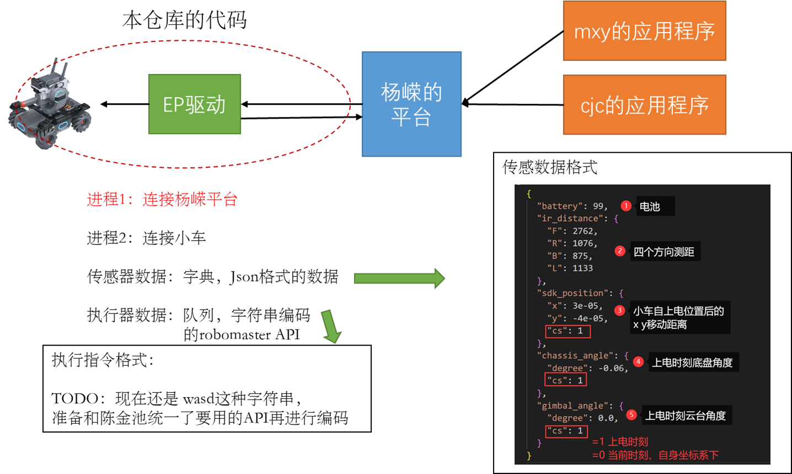

# rm_driver

[TOC]


本仓库是为[上下文服务平台](https://gitee.com/Crabor/frame)编写的驱动。




---

## 驱动程序

所有的驱动程序代码都在`src`目录下

【TODO】分割驱动实现`src`和驱动测试`test`代码。


### 驱动程序启动指令

```python
python driver_wrapper.py
```

该命令会启动多个进程， 分别是

- `ep_conn_raiser` ep小车控制进程
- `server_conn_raiser `连接上下文平台的进程

当终端显示文字: `驱动状态 = 1`时，上述进程启动完成。


如果进程启动和运行期间发生异常，`驱动状态 = -1`;如果进程还未启动，`驱动状态 = 0`;如果收到外部的关机事件，`驱动状态 = 2`.


启动完成后，驱动主进程周期性检查子进程在线情况。如果有进程结束，主进程也跟着结束。

【TODO】如果是`ep_conn_raiser`结束，不应该结束全部进程，而应该排除故障并重连。


### 【ep_conn_raiser 】小车控制进程

- 使用大疆官方SDK连接一辆EP小车
- 以20Hz的频率订阅传感器数据，并写入同步字典 `senser_syncer`
- 依次从执行指令`actuator_syncer`队列取出指令，并调用执行API

#### 传感器数据

来自同步字典 `senser_syncer`，

【注意】该字典不是python 基础字典类`dict`，是多进程同步字典`multiprocess.Manager.dict()`

因此不能直接使用`print`或`json.dump`，请`copy.deepcopy`为基础字典类实例再进行操作。

```python
# 全部导出
sensor_syncer = platform_resources['sensor_syncer']
json_str = ep_handler.json_dumps(sensor_syncer) # 预先写好的deepcopy函数
print(json_str)

# 访问单个元素
F_dis = sensor_syncer['ir_distance']['F']

# 修改单个元素 - [不推荐!!] 请将其视为只读 read-only 的字典
new_dist = 100
sensor_syncer['ir_distance']['F'] = new_dist
```

print结果：

```json
{
  "battery": 99,	# EP电池电量<8% raise Exception 提醒用户换电池
  "ir_distance": {
    "F": 2762,
    "R": 1076,
    "B": 875,
    "L": 1133
  },
  "sdk_position": {
    "x": 3e-05,
    "y": -4e-05,
    "cs": 1
  },
  "chassis_angle": {
    "degree": -0.06,
    "cs": 1
  },
  "gimbal_angle": {
    "degree": 0.0,
    "cs": 1
  }
}
```


#### 执行器数据

依次从执行指令`actuator_syncer`队列取出指令，并调用执行API

- 单次取指令执行示例：

```python
act = actuator_syncer.get()
x,y,deg = convert(act) # 从指令编码转为move API的参数
ep_robot.chassis.move(x,y,deg).wait_for_completed()
```

- 指令说明

| 指令编码 | 效果      | 等价SDK API                                |
| -------- | --------- | ------------------------------------------ |
| W        | 前进0.3米 | chassis.move(0.3,0,0).wait_for_completed() |
| D        |   后退0.3米        |     chassis.move(-0.3,0,0).wait_for_completed()                                      |
| A        |      左移0.3米     |         chassis.move(0,-0.3,0).wait_for_completed()                             |
| S        |   右移0.3米        |         chassis.move(0,0.3,0).wait_for_completed()                                 |
| L | 左转90度 | chassis.move(0,0,90).wait_for_completed() |
| R | 右转45度 | chassis.move(0,0,-90).wait_for_completed() |
| q/Q | 结束驱动 | ep_robot.close() |

【TODO】废弃convert函数，将参数直接内嵌为json key-args

【TODO】区分`move`和`drive_speed`

【TODO】新增执行状态或时间戳，如当前正在执行动作`move`，丢弃队列收到指令【无可用执行器】


### 【server_conn_raiser】连接上下文平台的进程

向上下文服务平台收发数据，[此处](https://gitee.com/Crabor/frame/tree/yr#python%E7%89%88%E6%9C%ACwrapper)为python wrapper的示例。

需要对如下部分进行修改：

```
        if obj["cmd"] == "sensory_request":
            value = {}
            value["speed"] = 10.0
            value["longitude"] = 20.0
            value["latitude"] = 30.0
            response = {}
            response["cmd"] = "sensory_back"
            response["message"] = json.dumps(value)
            send(socket, json.dumps(response))
```

【TODO】 联合测试


---

## config.json EP的明文协议

```json
{
    "name":"RoboMasterEP",
    "type":"Sensor",
    "fields":["GroupSensor"]
}
```

目前只有一个`fields`，是所有数值类订阅值的集合：包括测距值、电量、位移值、角度。

----


## TODO

可以进行的改善：

- [ ] 仓库新建test目录，写一些局部模块的驱动测试代码。
- [ ] 驱动增加ep车排障和重连机制：没电、网路不对、执行出错etc。
- [ ] 优化执行设备的驱动，兼容mxy的姿态调整 和 cjc的正常运行

- [ ] 为cjc的应用程序新增`fields` 图片`Image`，包括[config.json] 和传感数据修改
